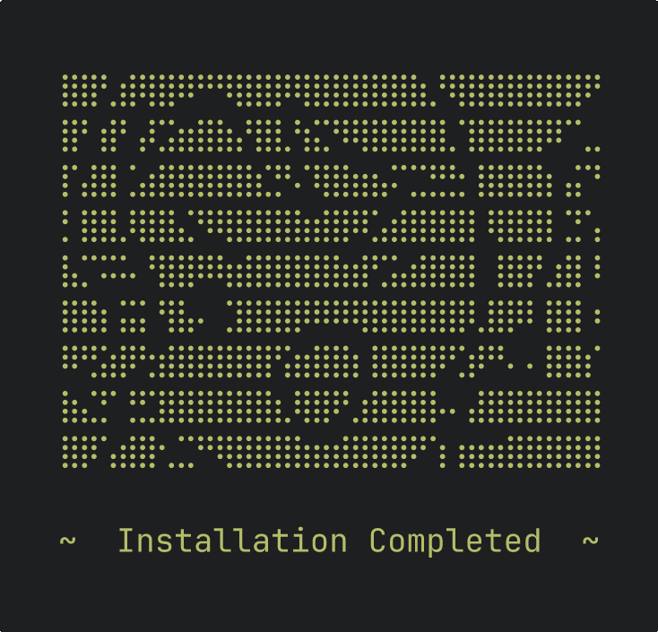

# System

Automated installation of essential system packages from scratch (Debian 13 and i3wm)



## Usage

```sh
./install                  # every stage: llvm apt deb docker nodejs nvim the_end
./install nodejs nvim      # only these stages
./install --skip docker    # all but these
```

Needs `sudo`. Each stage is a script in [`stages/`](stages)

## Recording

With [asciinema](https://asciinema.org) and [agg](https://github.com/asciinema/agg), in Tomorrow Night colors:

```sh
asciinema rec --cols 32 --rows 13 -c "printf '\e[?25l'; bash stages/the_end | expand -t 2 | head -n -1" preview.cast
agg --font-family "JetBrainsMonoNL Nerd Font Mono" --font-size 36 \
    --theme 1d1f21,c5c8c6,282a2e,cc6666,b5bd68,f0c674,81a2be,b294bb,8abeb7,c5c8c6,969896,cc6666,b5bd68,f0c674,81a2be,b294bb,8abeb7,ffffff \
    preview.cast preview.gif
# keep the last frame
ffmpeg -i preview.gif -update 1 preview.png
```
